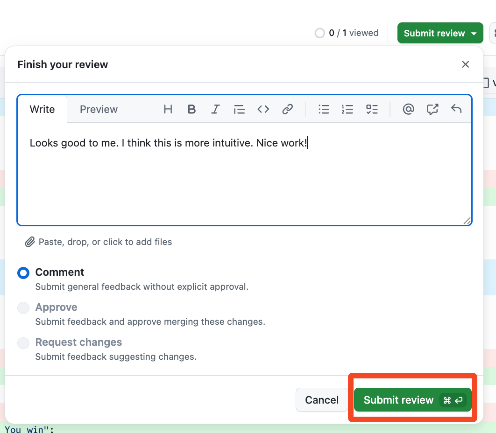

## Step 3: レビューする

_自分を担当者にできました！ :tada:_

### 📖 理論: pull request のレビュー

**pull request のレビュー** は、他の共同作業者やコミュニティのメンバーから、提案された変更に対してもらうフィードバックです。品質を保ち、プロジェクトを前に進めるのに役立ちます。さらに大切なのは、他の人が問題にどう取り組んでいるかを見て、プロジェクトへの理解を深め、開発者として成長できる機会になることです。

レビューをもらういちばんの方法は、依頼することです。レビュアーを指定すると、レビュアーは次の 3 つの方法でフィードバックできます。

- **Comment** - 承認も却下もしない、一般的なフィードバックです。
- **Approve** - [ルールセット](https://docs.github.com/en/repositories/configuring-branches-and-merges-in-your-repository/managing-rulesets/about-rulesets)、[コードオーナー](https://docs.github.com/en/repositories/managing-your-repositorys-settings-and-features/customizing-your-repository/about-code-owners)、ほかのポリシーが適用されている場合に、マージを可能にします。
- **Request Changes** - 提案された変更が期待に達しておらず、追加の作業が必要という意味です。修正後に、あらためてレビューを依頼します。

**Files changed** タブが、フィードバックを集める主な場所です。レビューを提出する前に、行に直接コメントを付けられます。

#### レビューの一般的な進め方

1. **title**（タイトル）と **description**（説明）が明確で簡潔かを確認します。意図した変更と、関連する Issue が分かるようになっているのが望ましいです。

1. **Files changed** タブを確認し、提案されたコードがすべて説明どおりかを確かめます。

1. たいていの変更では、提案された変更を実際に動かしてみて、意図どおりかを検証します。

1. レビューの要件、テスト、品質確認などについては、リポジトリの[コントリビューションガイド](https://docs.github.com/en/communities/setting-up-your-project-for-healthy-contributions/setting-guidelines-for-repository-contributors)を参照します。

#### レビューの観点

- 潜在的な問題・リスク・制約を見つける。
- 変更や改善を提案する。
- レビュー中の pull request が考慮していない、今後の変更について知らせる。
- 認識が合っているかを確かめる質問をする。
- 作成者がうまくやれている点、今後も続けてほしい点を挙げる。
- 重要なフィードバックから優先して伝える。
- 簡潔に、_かつ_ 意味のある詳しさで書く。
- pull request の作成者に敬意と思いやりを持って接する。

### ⌨️ やること: レビューする

1. pull request で **Files changed** タブをクリックします。

1. 変更内容をひととおり確認します。

   - 変更は単純な言い回しの調整であることに注目してください。

1. 差分表示の上にある **Submit review** ボタンをクリックします。

1. 次のコメントを入力し、**Submit review** ボタンをクリックします。

   ```md
   Looks good to me. I think this is more intuitive. Nice work!
   ```

   

   > 🪧 **注:** 自分の pull request に対しては、**Approve** と **Request changes** は選べません。

1. レビューを提出したので、Mona が作業を確認しています。少し待って、コメントを見てください。進捗と次の Step が投稿されます。

   > ❗ **注意:** まだ pull request をマージしないでください。