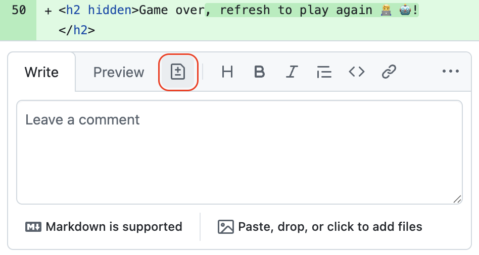

## Step 4: 変更を提案する

_レビューできました :sparkles:_


レビューをしていると、説明するより直したほうが早い、ちょっとした変更が見つかることがよくあります。誤字や言い回しの修正などです。こうした場面では **Add a suggestion** の機能がぴったりです。

### 📖 理論: suggested changes（変更の提案）

**Add a suggestion** は、コメント入力欄にあるボタンです。押すと、専用の書式のコードブロックが挿入されます。GitHub は、コメントを表示するだけでなく **Commit suggestion** ボタンも表示します。作成者はボタンひとつで提案を受け入れてコミットできます。コードエディターを開く必要はありません。便利ですね！

### ⌨️ やること: 変更を提案する

1. pull request で **Files changed** をクリックします。

1. `index.html` ファイルの差分表示を探します。

1. 変更された行の行番号の横にカーソルを合わせます。

1. プラスのアイコンをクリックすると、クリックした行へのコメント入力欄が開きます。

1. **Add a suggestion** ボタンをクリックすると、元の行が編集できる形で挿入されます。

   

1. 提案の内容を次のとおりに書き換え、**Comment** ボタンをクリックします。

   ````md
   ```suggestion
   <h2 hidden>Game over! Want to play again?! Just click refresh. 🧑‍🚀!</h2>
   ```
   Let's make it a bit more friendly. 🤓
   ````

### ⌨️ やること: 提案された変更を適用する

1. pull request のメニューで **Conversation** タブを選びます。

1. 下へスクロールし、**Commit suggestion** ボタンをクリックすると、コミットメッセージの入力欄が開きます。

1. コミットメッセージを次の内容に書き換え、**Commit changes** ボタンをクリックします。

   ```markdown
   Make the end game experience more friendly
   ```

1. 変更をコミットしたので、Mona が作業を確認しています。少し待って、コメントを見てください。進捗と次の Step が投稿されます。
